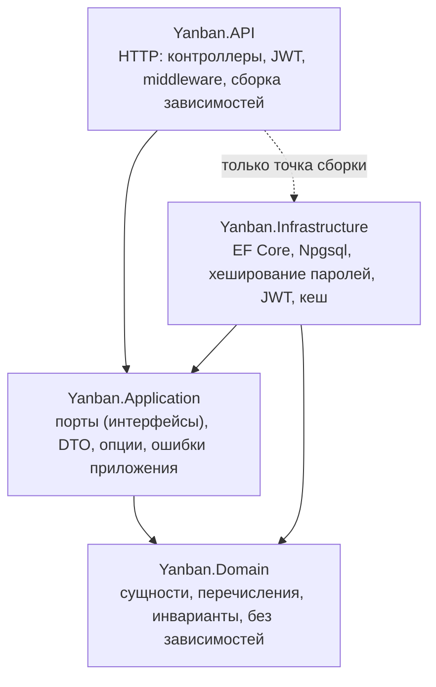

# Yanban

Yet another Kanban. Доски с участниками и ролями, колонки,
drag-and-drop карточек, комментарии, вложения, обновления в реальном времени и
полнотекстовый поиск. Бэкенд на ASP.NET Core 9, SPA на React.

## Возможности

- Доски с участниками и ролями, приглашение по email.
- Колонки и карточки: заголовок, описание, срок, исполнитель.
- Drag-and-drop карточек, оптимистично, с откатом при ошибке.
- Комментарии к карточкам.
- Вложения: загрузка и скачивание напрямую в объектное хранилище (S3/MinIO).
- Обновления в реальном времени у всех, кто смотрит доску (SignalR).
- Полнотекстовый поиск по карточкам (Cmd/Ctrl+K).
- Журнал активности (аудит) с фильтрами и поиском.
- Почтовые уведомления с настройками, подтверждение email при регистрации.
- Шаблоны карточек и стартовые шаблоны доски.
- Автосохранение карточки, вставка файла из буфера (Ctrl+V), превью картинок.
- Темы (системная, светлая, тёмная).

## Архитектура

Слоистая архитектура: минимальная структура, которая показывает разделение ответственности.



Правило зависимостей: API зависит от Application, Application от Domain,
Infrastructure от Application и Domain. API знает про Infrastructure только в
точке сборки (регистрация зависимостей). Бизнес-код зависит от интерфейсов в
Application, а не от конкретной инфраструктуры. Домен не имеет внешних пакетных
зависимостей.

Стек: ASP.NET Core 9 и C#, PostgreSQL 16 с EF Core 9 (Npgsql), SignalR по
WebSocket, S3-совместимое хранилище (MinIO), почта через MailKit по SMTP.
Фронтенд: React 19, TypeScript, Vite, dnd-kit, TanStack Query.

## Как запустить

### Через Docker

Нужен только Docker Desktop.

```bash
docker compose up --build
```

Поднимутся шесть сервисов: frontend, API, worker, Postgres, MinIO, Mailpit.
API применяет миграции при старте, поэтому база готова сразу.

- Приложение: http://localhost:8080 (SPA, nginx проксирует `/api` на API)
- API напрямую: http://localhost:8081
- Почта (Mailpit): http://localhost:8025, тут лежат все письма, включая ссылку
  подтверждения регистрации
- Postgres: `localhost:5432`, база и пользователь `yanban`, пароль
  `yanban_dev_password`
- MinIO: API `localhost:9000`, консоль `localhost:9001` (`minioadmin` /
  `minioadmin`)

Зарегистрируйтесь, откройте письмо в Mailpit, подтвердите email, и доска готова.
Чтобы поменять значения по умолчанию, скопируйте `.env.example` в `.env` и
отредактируйте, Compose подхватит файл сам.

### Без Docker

Нужны .NET 9 SDK, Node 20+ и три инфраструктурных сервиса. Проще всего поднять
инфраструктуру в контейнерах, а приложение запускать нативно:

```bash
docker compose up -d postgres minio mailpit
```

Затем три процесса приложения, каждый в своём терминале:

```bash
cd backend/Yanban.API    && dotnet run     # API на http://localhost:5214
cd backend/Yanban.Worker && dotnet run     # worker: почта и сборка мусора в S3
cd frontend && npm install && npm run dev  # SPA на http://localhost:5173, проксирует /api
```

Worker это отдельный процесс, он обрабатывает поставленные в очередь письма и очищает S3 от удаленных из БД объектов.

## ER-диаграмма


